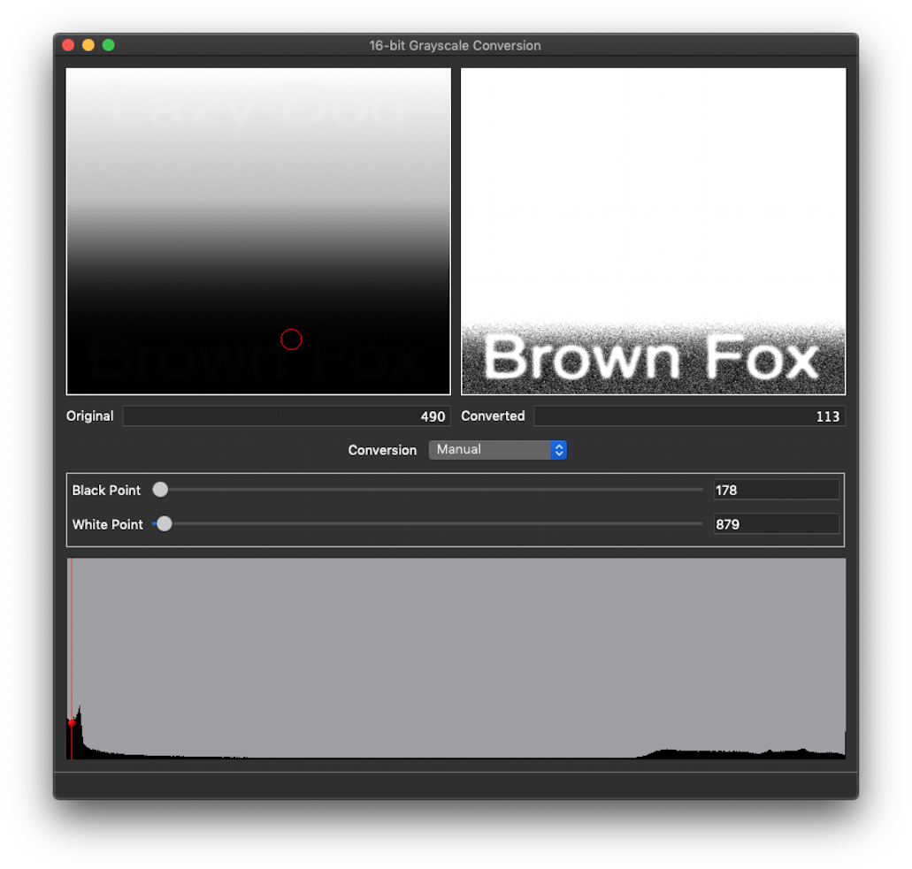

Gray16Lib + Gray16Demo
======================
Gray16Lib is a library to provide various grayscale image processing algorithms to down-convert 16-bit grayscale images to bit-depths that are viewable on standard displays and maintain image contrast.

16-bit grayscale imagery is commonly encountered in scientific fields. Two notable examples include X-Ray and Aerial imaging. Sensors may raster data such as light intensity, or elevation data, using a 16-bit value. Typical consumer displays are capable of displaying 24-bit color (8-bits per channel: Red/Green/Blue, with some supporting pseudo 10-bit, usually 8-bit + FRC (Frame  Rate Control) - basically faking the extra depth by flashing a pixel between two colors). To view the 16-bits of data on a display capable of displaying on 8-bits, it becomes necessary to appropriately "throw away" pieces of data while still maintaining important image contrast or splitting the 16-bits across multiple channels of 8-bit data.

**Gray16Demo** is an example application that will load a 16-bit Grayscale PNG and allow the user to interactively explore different image processing algorithms. Open your own 16-bit PNGs or load an example from the **Examples** menu (see the [included 16-bit examples here](gray16demo/examples/Examples.md)).

Requirements
============
* Qt 5.13 (released [June 19th, 2019](https://blog.qt.io/blog/2019/06/19/qt-5-13-released/)) for support of [`QImage::Format_Grayscale16`](https://doc.qt.io/qt-5/qimage.html#Format-enum).
  * See also: [QTBUG-41176](http://bugreports.qt.io/browse/QTBUG-41176), [Gerrit patch](https://codereview.qt-project.org/#/c/239203/).

Image Processing Algorithms
===========================
1. Manual
    * Manually select Black-Point and White-Point values.
2. Offset / Gain
    * Offset pixel values then bit-shift them. No floating point operations.
    * Auto-Offset, Manual Gain
        * Offset chosen by least-exposed pixel, that isn't zero-exposed.
        * Offset (+ 255) chosen by most-exposed pixel, that isn't fully saturated.
3. False-Color (conversion to RGB32)
    * Converts a 16-bit grayscale to an RGB gradient. Supports various gradients.
    1. **Black Body**

Compiling Gray16Lib
===================
    git clone https://github.com/linville/gray16lib.git
    cd gray16lib
    qmake gray16lib.pro
    make

Todo
====
* Add more algorithms.
* Add more examples.

Additional Reading
==================
* Mootz and Mathews. "[Displaying and Stretching 16-bit per Band Digital Imagery.](https://www.fsa.usda.gov/Assets/USDA-FSA-Public/usdafiles/APFO/support-documents/pdfs/film_vs_digital_linear_non-linear_stretches.pdf)" USDA FSA

