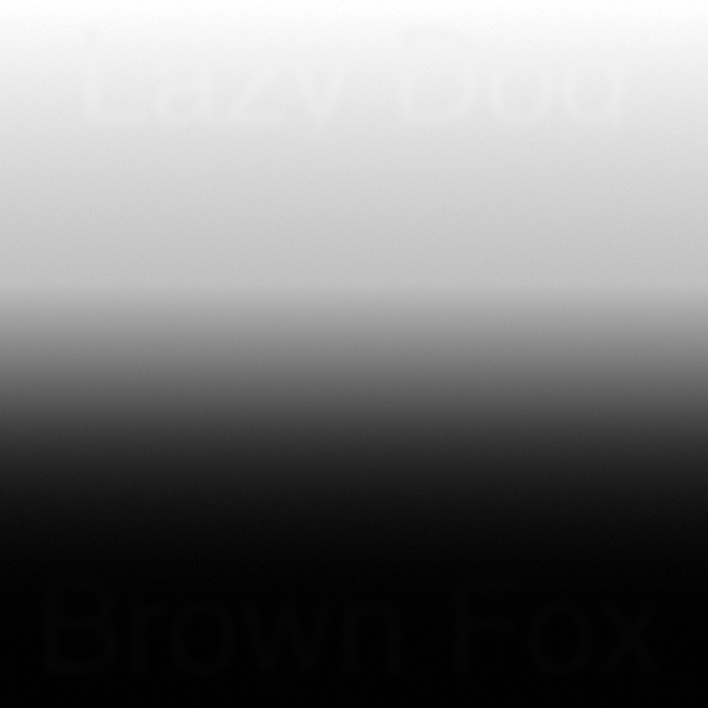

The following examples are included with the Gray16Demo application and can be loaded from the **Examples** menu.

Example 1
---------
* Source: Synthetically created using Affinity Designer.
* Author: Aaron Linville
* Image License: [CC-BY-SA-4.0](https://creativecommons.org/licenses/by-sa/4.0/)

Contributing
============
Have an interesting 16-bit grayscale image that you make available under a Creative Commons license? Attach it to [a new issue](https://github.com/linville/gray16lib/issues/new) or submit a pull request.